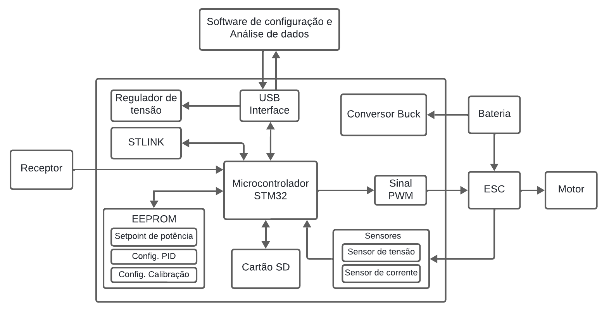

# Firmware do Controlador de Potência.

Este repositório contém o código fonte do firmwareda placa de controle

---

## Funcionalidades Principais

✅ Leitura de tensão e corrente do sistema.  
✅ Cálculo contínuo da potência elétrica consumida.  
✅ Controle automático via PID aplicado ao PWM do ESC.  
✅ Comunicação serial USB com protocolo estruturado.  
✅ Armazenamento de parâmetros em EEPROM externa.
✅ Registro de dados em cartão SD. 

---

## Microcontrolador Utilizado

- **STM32F103**

---

## Arquitetura do Firmware

O firmware é organizado em módulos independentes:

- **stm_firmware.ino/** → setup e loop principais.  
- **pid.ino/** → algoritmo de controle PID.
- **communication.ino** → comunicação serial e protocolo STX/ETX.  
- **eeprom.ino/** → leitura, escrita e validação de parâmetros.  
- **sdcard.ino/** → salvamento de logs.

---

## 📡 Protocolo de Comunicação

A comunicação com o software de parametrização utiliza mensagens seriadas estruturadas:

- `STX (0x02)` → início
- `CMD` → identificador da operação
- `Payload` → dados
- `Checksum` → verificação
- `ETX (0x03)` → término

Esse formato garante interpretação correta e evita quadros corrompidos.
---
